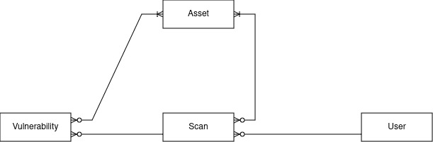
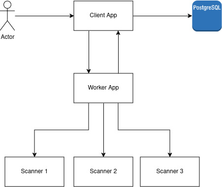
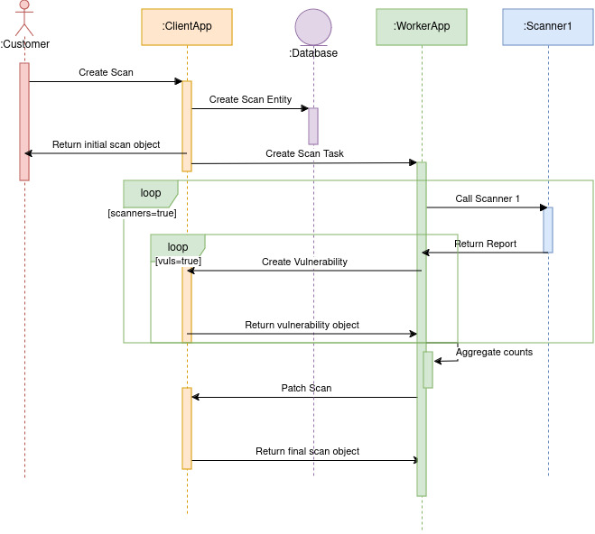

# Introduction
This is a vulnerability scan app where users can
1. Register assets of the system
2. Run and get scan report
3. Get vulnerabilities from scan and asset

# How to run
## Dependencies
- Python 3.10

1. `pip install -r requirements.txt`
2. `uvicorn src.main:app`
3. http://localhost:8000/docs

# Thinking Process
## Object/Entity Relationships

I first checked the relationships of the objects as documented in the json files. From this, I can design the tables 
needed for the api, and an idea how I would want to serve the API.

## Sequence Diagram and Architecture

I decided to design the solution by separating it into two microservices, one as the client app and the other as the 
worker app. I separated them so that their own responsibilities are clear from each other.

The client app will be responsible for serving the users that wants to scan the assets. Registration of users and assets
which will be part of the system are also here as an endpoint. It will also be used by the worker app to update the 
status of scan and add vulnerabilities. The client app will also own the relational database for the content.

The worker app will be responsible for taking tasks to do the actual scans. It will have the capability to call the
scanners and will know how to integrate with them. It is also responsible in aggregating the results from different
scanners and then calling the needed client app endpoints to reflect the report and show it to the user. I won't be
creating the actual app for this one as the result of the scanner is unknown from me.

Below is the sequence diagram when the client creates a scan resource with the client app

As shown, once a scan resource is created from the client app, it will trigger a call to the worker app and will do the
steps as follows:
1. Call scanner and wait for report
2. Create vulnerabilities for scan in client app from the scanner report. Repeat until all vulnerabilities are created
3. Repeat 1 and 2 for other scanners
4. Aggregate scanner reports to come up with the total severity counts
5. Patch scan in client app to update severity counts and status to completed

From the user's viewpoint, the user can poll the Get Scan Endpoint to check if the status is completed to know that
the scan is finished. The user can get the severity counts from this same endpoint. To get the specific vulnerabilities,
the user can use the Get Vulnerabilities with Query using the from_scan and affected_asset ids.